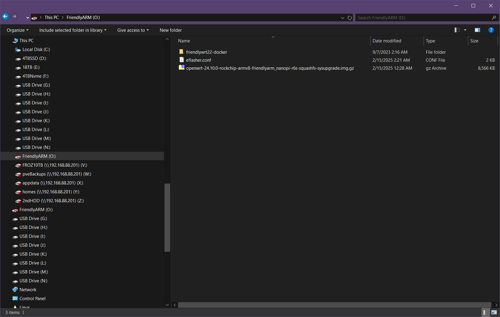
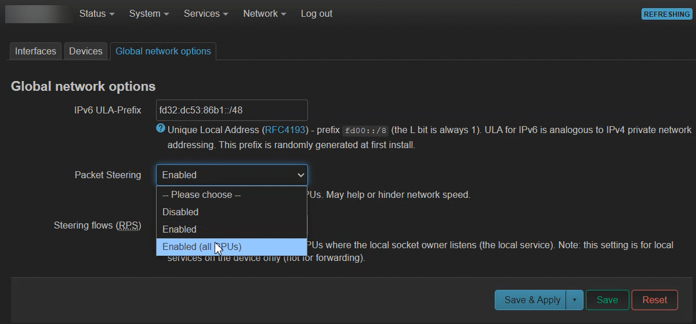

# Introduction
As of February 3, 2024 the NanoPi R6S now has an official stable OpenWrt release starting with version 24.10.0.

View the firmware downloads here: https://downloads.openwrt.org/

The R6S images are located under `Stable Release > rockchip > armv8`

I'd recommend the squashfs image if you're new at this. The squashfs image allows for factory reset and full system backup and easy future firmware updates with the sysupgrade tool. The only con is it has limited storage space. You can read more about the pros and cons of ext vs squshfs [here](https://openrouters.com/docs/openwrt-chose-ext4-or-squashfs-image/).

With the official OpenWrt image there's no longer a need to do the [CPU performance tweaks](https://github.com/StarWhiz/NanoPi-R6S-CPU-Optimization-for-Gigabit-SQM)! 

I figured out how to flash the stable official OpenWrt released on Feb 3, 2025 that includes the R6S by referencing this [section of FriendlyElec's guide](https://wiki.friendlyelec.com/wiki/index.php/NanoPi_R6S#Flash_third_party_OS_.28Image_file.29_to_eMMC).

Optional Alternative: If you're new ignore this alt method. For advanced  users a quicker method you can use is the [DD method here](https://forum.openwrt.org/t/nanopi-r6s-with-openwrt/167611/487) if you already have FriendlyWrt running on eMMC, but you'd lose the ability to boot from MicroSD card afterwards.

# Preparing MicroSD Card for Flash to eMMC
* Using BalenaEtcher, flash the MicroSD Card with any of the eflasher firmwares available at http://download.friendlyelec.com/NanoPiR6S 
* These are located in (in the "01_Official images/02_SD-to-eMMC images" directory). 
	* Just pick the smallest one it doesn't matter what is chosen
* After flashing the image with BalenaEtcher, you should see a drive with the name of `FriendlyARM` show up in your file explorer. Nagivate and open this directory.
* Download the official OpenWrt Image for your Nano Pi R6S [here](https://downloads.openwrt.org/)
	* At the time of writing this guide. I'm using the `openwrt-24.10.0-rockchip-armv8-friendlyarm_nanopi-r6s-squashfs-sysupgrade.img.gz` image which is the first stable release of OpenWrt that includes the R6S!
* Copy `openwrt-24.10.0-rockchip-armv8-friendlyarm_nanopi-r6s-squashfs-sysupgrade.img.gz` into the root of the `FriendlyARM` drive.
 
* Open and edit `eflasher.conf` with a text editor inside the same directory here.
	* Set “autoStart=” to the name of your image file
		* In my example it is 
```
autoStart=openwrt-24.10.0-rockchip-armv8-friendlyarm_nanopi-r6s-squashfs-sysupgrade.img.gz
```
* Save your edits above!
* Eject the MicroSD card after your edits.
* Insert the MicroSD card into your NanoPi R6S
* Power the R6S on. it will automatically install your firmware. You can watch the installation progress by observing the LEDs’ status.
* Congrats you've flashed OpenWrt firmware on the R6S!'
* After installation remove the microSD card from your R6S otherwise it will boot from MicroSD instead of eMMC.
* Default Logins
	* user = root
	* pass = password
	* router IP = 192.168.1.1

# Enable Packet Steering to go past 700 Mbps SQM
The last step you need to do is to enable Packet Steering on all CPUS to go past 700 Mbps SQM without the CPU Performance tweaks. I personally got 1400 Mbps with SQM on which is the most my own ISP provides.

* This is done under Network > Interfaces > Global network options tab

 

# DD Method
If you don't want to use the method above you can try the way dsouza showed me on the OpenWrt forums below is what he had to say. Keep in mind the DD method will no longer allow you to boot from SD card so stick to the FriendlyWrt method above if you want to preserve that ability.

Source: https://forum.openwrt.org/t/nanopi-r6s-with-openwrt/167611/487

```
You can also use dd to flash an OpenWrt sysupgrade image to eMMc. Personally I think it is much easier and faster, specially if you are already running OpenWrt from SD card. Example:

cd /tmp
wget https://downloads.openwrt.org/releases/24.10.0/targets/rockchip/armv8/openwrt-24.10.0-rockchip-armv8-friendlyarm_nanopi-r6s-squashfs-sysupgrade.img.gz
gzip -d openwrt-24.10.0-rockchip-armv8-friendlyarm_nanopi-r6s-squashfs-sysupgrade.img.gz
dd if=openwrt-24.10.0-rockchip-armv8-friendlyarm_nanopi-r6s-squashfs-sysupgrade.img of=/dev/mmcblk1 bs=1M
reboot

To transfer the configuration, just backup from OpenWrt running from the SD card and restore after you boot OpenWrt from eMMC.

Be aware that once you have OpenWrt on eMMC, you will not be able to boot from SD card anymore (OpenWrt bootloader does not seem to give preference to SD cart when booting).

For this reason I prefer booting OpenWrt from the SD card, and mount eMMC as ext4 storage.
```
