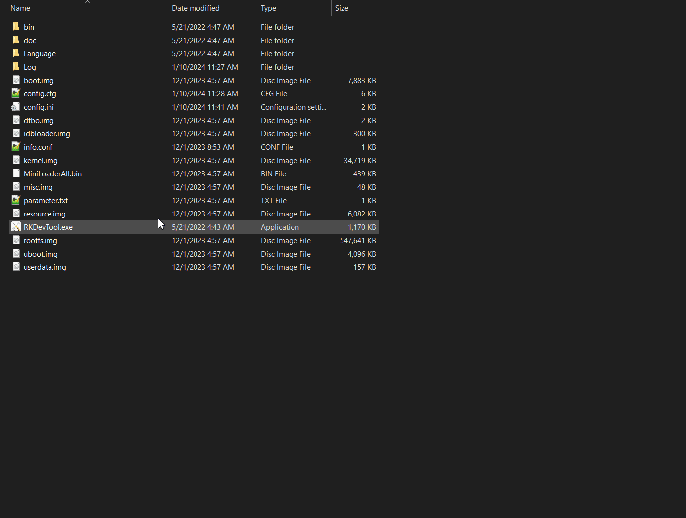
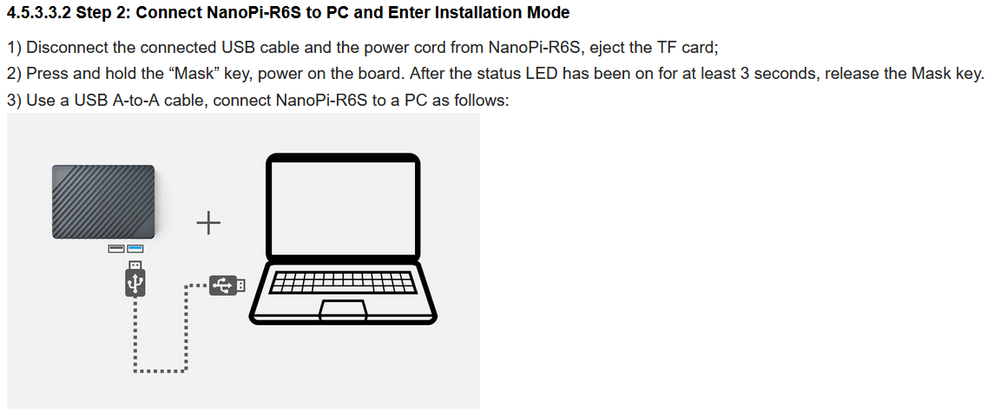
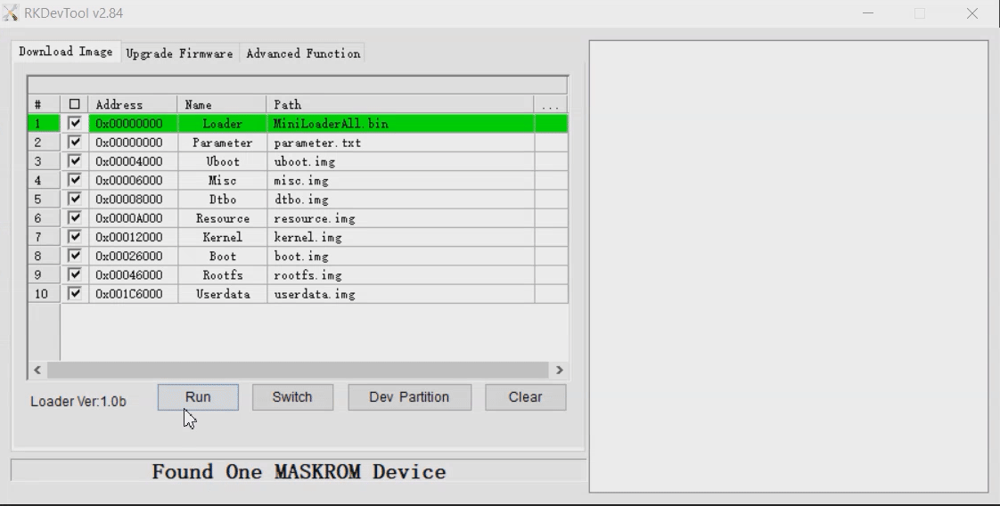

# R6S FriendlyWrt Recovery Notes
This is how I recover my bricked NanoPi R6S devices with openWrt. For me, the [official instructions ](https://wiki.friendlyelec.com/wiki/index.php/NanoPi_R6S#Option_3:_Install_OS_via_USB) were hard to follow and I kept doing unncessary steps. It also didn't explain how to change the RKFlasher's tools langauge to English.

Requirements
* USB-A to USB-A Cable

## Download the USB upgrade Image
* Go to the [official google drive](http://download.friendlyelec.com/NanoPiR6S). 
* Navigate to "01_Official images/03_USB upgrade images". 
* Then choose either rk3588-usb-friendlywrt-XX.XX-docker-######## or rk3588-usb-friendlywrt-XX.XX-######## depending on if you plan to use docker or not. 
*Download and extract it.


## RKFlasher Language Change
Change the language by editing config.ini and changing the "Selected" portion from 1 to 2

```
...
[Language]
Kinds=2
Selected=1
...
```

To
```
...
[Language]
Kinds=2
Selected=2
...
```



## Enter installation mode

Note: TF Card is the MicroSD card...

## Flash!
Double click on RKDevTool.exe that's in the same location you just changed the language in, you will see a “Found One Maskrom device” message on the utility. Click on the "Run", wait a moment and it will be installed.



The official instructions say "After installation is done your system will automatically reboot and load the system from eMMC."

Now your device should be unbricked!

If something went wrong you could try an additional step where you use a MicroSD card to flash the image to eMMC.

# Done!

## Optional: MicroSD Card eflasher creation
* Go to the [official google drive](http://download.friendlyelec.com/NanoPiR6S). 
* Navigate to "01_Official images/02_SD-to-eMMC images"
* Download the eflasher Image you want.
    * Examples:
    * rk3588-eflasher-friendlywrt-##.##-docker-########.img.gz
    * rk3588-eflasher-friendlywrt-##.##-########.img.gz
* Flash the image to your microSD card with the win32diskimager tool (Located in the "05_Tools" directory of the same Google Drive)

## Optional: Flashing with MicroSD Card
* Unplug power from the NanoPi. 
* Insert the microSD Card into the NanoPi R6S. 
* Power it back on.
* From the LEDs you can see that the new image is being flashed to eMMC. After it's done you can power off unplug the microSD and power it back on.
